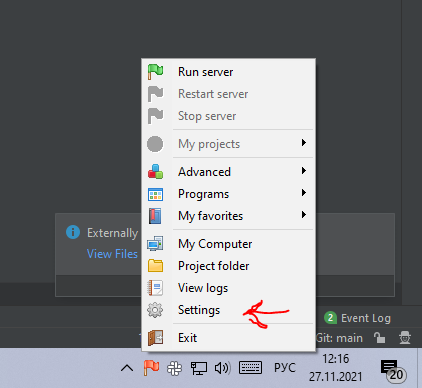

## [На главную](../README.md)

### Инструкия по запуску сервера для доступа с другого устройства
* Включить программу `OpenServer` (Пукс -> OpenServer)

* Узнать ip компьютера. 

Например через коммандную строку -> `ipconfig` (интересует IPv4-адрес)

* Проерить ip компьютера и заданного в настройках OpenServer

Открыть контекстное меню и зайти в настройки OpenServer  

Перейти во вкладку Aliases.

Если ip адрес компьютера не совпадает с заданным в `SourceDomain`, то изменить его
1. Дважды нажать на существующую строку адреса. (он переместится в верхнее поле)
2. Изменить ip на текущий и нажать кнопку `Add`
3. Сохранить настройки кнопкой `Save` (Если OpenServer запущен (зеленый флажок), то он попросит перезапустится - необходимо согласится)
ьсьв
4. Закрыть настройки

* Запустить OpenServer кнопкой `run server` 
